# 🌱 AI-Powered Potato Crop Growth Stage & Nutrient Health Management  

## 📌 Problem Statement  
Develop an AI solution that uses satellite imagery to simultaneously detect **growth stages of potato crops** and **map nutrient health** (e.g., Nitrogen levels).  

The system should deliver **precise, stage-specific irrigation and fertilizer recommendations** to:  
- Maximize yield  
- Optimize resource use  
- Reduce costs  
- Improve long-term soil health  

---

## 🚜 Why It Matters  
- Incorrect timing of irrigation or fertilization can drastically reduce yields.  
- Inefficient nutrient management increases costs and degrades soil quality.  
- An **integrated growth stage–nutrient health** approach ensures resources are applied at the **right time, in the right quantity, and to the right zones**.  

---
🚧 **Note:** We were only told to implement **30% of the project**.
- Nutrient health mapping and the complete recommendation system using gen-ai are planned but not yet implemented.  

## 📂 Data Sources & APIs  
- 🌍 **Sentinel-2 satellite imagery**  
- 🌱 **NDVI/NDRE vegetation indices**  
- 🧪 **Soil fertility datasets**  
- 🌦 **Historical yield and weather data** (optional for refinement)  

---

## 🎯 Prototype Goals  
- Process **sample satellite images** of potato fields  
- Classify fields into **at least 3 growth stages**  
- Highlight **low-fertility zones** using NDVI/NDRE analysis  

---

## 🏗️ System Architecture  

```mermaid
flowchart TD
    A[Start] --> B[Collect Satellite Data]
    B --> B1[Sentinel-2 Images via Copernicus API]
    B --> B2[NDVI / NDRE Indices from SentinelHub API]
    B --> B3[Optional: Soil Fertility & Weather Data]

    B1 --> C[Preprocessing]
    B2 --> C
    B3 --> C

    C --> D[Crop Growth Stage Detection Model]
    D --> D1[Classify: Early Growth / Mid Growth / Bulking]

    C --> E[Nutrient Health Analysis]
    E --> E1[Detect Nitrogen Deficiency Zones using NDVI/NDRE]

    D1 --> F[Decision Engine]
    E1 --> F

    F --> G[Stage-Specific Recommendations]
    G --> G1[Irrigation Plan: When & How Much]
    G --> G2[Fertilizer Plan: What Type & Dosage]

    G1 --> H[Output Dashboard / Report]
    G2 --> H
    H --> I[End]
```

## 🧠 Core Components  

### 🧠 AI & ML Models Used  
- **MCLSTM (Multivariate Convolutional LSTM):** For capturing temporal + spatial crop growth changes  
- **DeepCGM (Deep Crop Growth Model):** For growth stage classification & nutrient health estimation  
- **Classification Model (Random Forest / XGBoost):** Fertilizer usage recommendation 

### 🔹 Data-Driven Insights  
- NDVI/NDRE analysis for vegetation health.  
- Soil fertility overlays for nutrient deficiencies.  
- Historical yield-weather fusion for better predictions.  

### 🔹 Optimized Potato Yield  
- Stage-specific irrigation recommendation.  
- Nitrogen-level mapping for targeted fertilizer use.  
- Precision farming for **higher yield with lower cost**.  

---
## 📊 Correlation Matrix
Understanding the relationships between variables in our dataset.

---

## 🧹 Pre-processed Data
Sample of the cleaned and structured dataset used for training.

---

## ✅ Model Output
Accuracy results of the fertilizer recommendation model.

